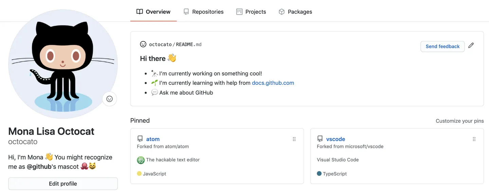
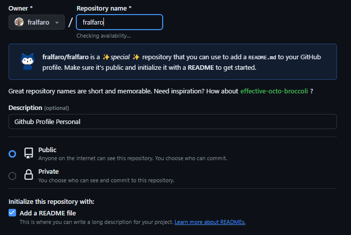
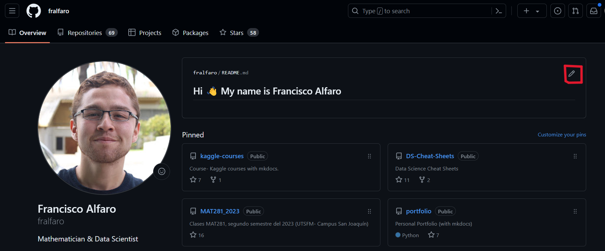
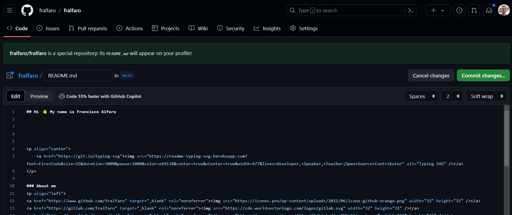
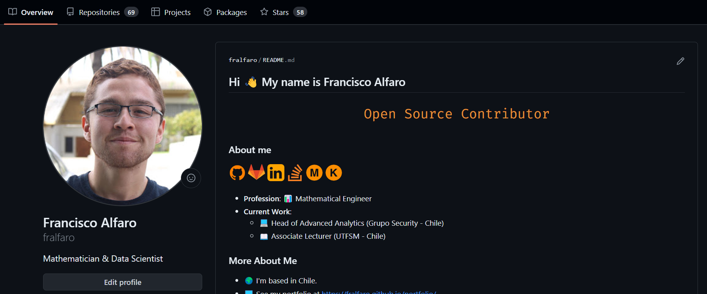
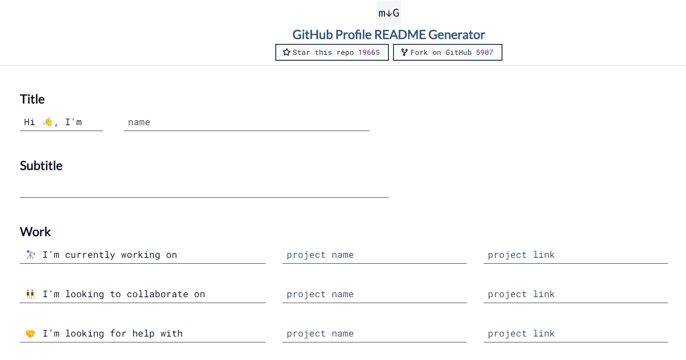
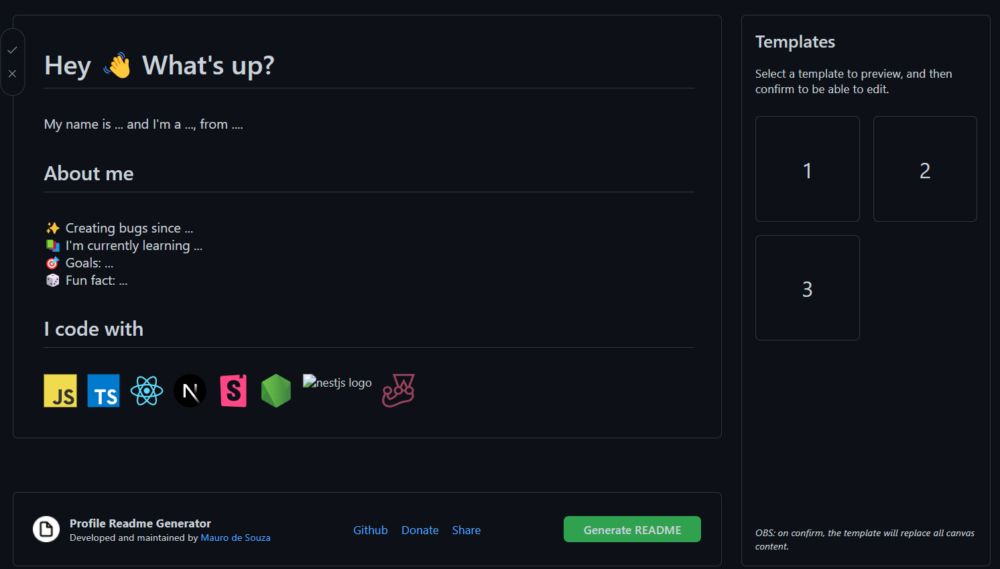
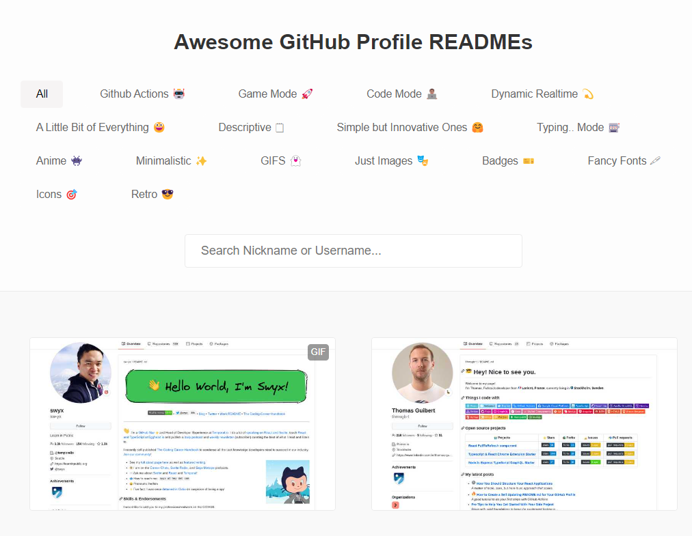

# Personalizando Github

 

Un perfil de GitHub es una tarjeta de presentación online
para desarrolladores. Te permite mostrar tus habilidades,
proyectos y experiencia a la comunidad de código abierto.

Un perfil bien elaborado puede ayudarte a encontrar trabajo,
colaborar con otros desarrolladores y construir tu marca personal.

En este artículo, te guiaremos paso a paso  para crear un perfil de GitHub completo y profesional.

> 🔑 **Nota**: Para seguir este tutorial, es necesario disponer de una [Cuenta en GitHub](https://docs.github.com/es/get-started/start-your-journey/creating-an-account-on-github). 
> Además, se recomienda actualizar tu foto de perfil y tu nombre de usuario.

## Sobre Github Profile

Un GitHub profile es una página personalizada que muestra 
tu actividad y contribuciones en la plataforma GitHub.

Funciona como tu identidad digital en la comunidad de desarrollo de software,
donde puedes compartir información sobre ti mismo, tus proyectos, y tu experiencia 
en el desarrollo de software colaborativo. Tu perfil de GitHub muestra una variedad de elementos,
incluyendo tu biografía, repositorios destacados, actividad de colaboración, organizaciones a 
las que perteneces, logros y reconocimientos, entre otros. 

Es una herramienta importante para
conectarte con otros desarrolladores, reclutadores y colaboradores potenciales, y para mostrar
tu habilidad y compromiso en el mundo del desarrollo de software.

## Crear Github Profile

> 🔑 Nota: Utilizaremos mi propio [perfil de GitHub](https://github.com/fralfaro/) como referencia.

### Crear un Nuevo Repositorio

- Dirígete a la página principal de GitHub y haz clic en el botón "New" (Nuevo) en la esquina superior derecha.
- Nombre del repositorio: Debe coincidir exactamente con tu nombre de usuario. Por ejemplo, si tu nombre de usuario es `fralfaro`, el repositorio se llamará `fralfaro`.
- Asegúrate de que el repositorio sea "Público".
- Selecciona la opción para "Add a README file" (Agregar un archivo README).
  
- Haz clic en "Create repository" (Crear repositorio).
- La estructura del repositorio será la siguiente:
  

### Añadir Información a tu README

- Visita tu perfil de GitHub y verás el siguiente diseño:
  
- Luego, haz clic en el icono del lápiz en la esquina superior derecha para editar el archivo.
  
- Agrega la información que deseas mostrar en tu perfil, como una breve biografía, enlaces a proyectos destacados, etc.
- Después de editar el README, desplázate hacia abajo y encontrarás el botón "Commit changes" (Confirmar cambios).
- Haz clic en este botón para guardar tus modificaciones.

### Visualizar tu Perfil
- Después de guardar los cambios, puedes ver cómo se ve tu perfil.
- Visita tu perfil de GitHub y verás las nuevas modificaciones que has realizado en tu README.

  

¡Listo! Ahora tu perfil de GitHub está configurado con la información que deseas mostrar. 
Los visitantes podrán conocer más sobre ti y tu trabajo gracias a tu README personalizado.

## Github Profile Pro

Para crear un GitHub Profile que refleje tu profesionalismo y destaque tus habilidades como desarrollador,
te dejamos algunos **tips**.

### Utilizar GitHub Profile README Generator

Un **GitHub Profile README Generator** es una herramienta o aplicación en línea que te permite crear de
manera rápida y sencilla un README personalizado para tu perfil de GitHub. 

Este tipo de generadores suelen ofrecer una interfaz amigable donde puedes ingresar información como tu biografía, 
enlaces a proyectos destacados, estadísticas de tu actividad en GitHub, y otros detalles relevantes. 
Una vez que hayas completado la información requerida, el generador te proporcionará el código
Markdown necesario para agregar el README a tu perfil de GitHub. 

[GitHub Profile README Generator - rahuldkjain](https://rahuldkjain.github.io/gh-profile-readme-generator/)

[GitHub Profile README Generator - maurodesouza](https://rahuldkjain.github.io/gh-profile-readme-generator/)

### Awesome GitHub Profile READMEs 

[Awesome GitHub Profile READMEs](https://zzetao.github.io/awesome-github-profile/) es una 
colección de ejemplos inspiradores y creativos de READMEs para perfiles de GitHub. 
Este recurso recopila una variedad de perfiles de GitHub que han sido personalizados de manera única y creativa utilizando
Markdown y otros recursos disponibles en GitHub.

Sirven como fuente de inspiración para los usuarios que desean mejorar la apariencia y
el contenido de su propio perfil de GitHub. Además, esta colección puede ayudar 
a los usuarios a aprender nuevas técnicas y trucos para destacar sus habilidades, 
proyectos y personalidad a través de su perfil de GitHub. 

## Conclusión

Los GitHub Profile ofrecen una plataforma única
para que los desarrolladores muestren su trabajo,
experiencia y personalidad en la comunidad de desarrollo de software. 

1. **Identidad Digital**: Los perfiles de GitHub sirven como la identidad digital de los desarrolladores en la comunidad de GitHub, permitiéndoles presentarse a sí mismos y su trabajo de manera efectiva.

2. **Transparencia y Colaboración**: La sección de actividad de colaboración proporciona una visión transparente de la contribución y el compromiso del usuario en proyectos de código abierto y colaboraciones con otros desarrolladores.

3. **Personalización y Creatividad**: Los usuarios tienen la libertad de personalizar sus perfiles con biografías, repositorios destacados, logros y otros elementos para reflejar su personalidad y habilidades únicas.

4. **Fuente de Inspiración**: Los GitHub Profile pueden servir como fuente de inspiración para otros desarrolladores, proporcionando ejemplos creativos y únicos de cómo presentar su trabajo de manera efectiva en la plataforma.

Al seguir los consejos y las mejores prácticas compartidas en este artículo, puedes crear un perfil de GitHub que refleje tu profesionalismo, creatividad y pasión por la programación. ¡Aprovecha al máximo esta poderosa herramienta y haz que tu GitHub Profile sea un reflejo auténtico de quién eres como desarrollador!.