# Personalizando repositorios de Github

 

Cuando trabajas en un proyecto en GitHub, a menudo te encuentras con el
desafío de presentar tus trabajos de manera efectiva. 

Ya sea que estés desarrollando una aplicación, quieras mostrar 
los proyectos realizados durante un diplomado o en algún curso en línea (MOOC), 
es crucial saber cómo destacar tu trabajo de la mejor manera posible.

En este artículo, te guiaré a través de algunos métodos efectivos para mostrar
tus diversos repositorios según tus necesidades específicas.

> 🔑 **Nota**: Para seguir este tutorial, es necesario disponer de una [Cuenta en GitHub](https://docs.github.com/es/get-started/start-your-journey/creating-an-account-on-github). 
> Además, se recomienda actualizar tu foto de perfil y tu nombre de usuario.

## Sobre los repositorios de Github

Un repositorio en GitHub es un espacio donde se almacenan y gestionan 
los archivos de un proyecto de software utilizando el sistema de control de
versiones Git.

En términos simples, es como una carpeta o un directorio
en tu computadora donde guardas todos los archivos relacionados
con tu proyecto, pero alojado en la nube y accesible para ti y 
para otros colaboradores.

Además de ser un lugar para almacenar archivos, GitHub proporciona 
una serie de herramientas y funcionalidades que facilitan la colaboración 
entre desarrolladores.  

Estas incluyen seguimiento de problemas (issue tracking), 
solicitudes de extracción (pull requests), revisión de código (code review),
integración continua (continuous integration) y mucho más. 

Estas características hacen que GitHub sea una plataforma poderosa para el 
desarrollo de software en equipo y la colaboración en proyectos de código abierto.

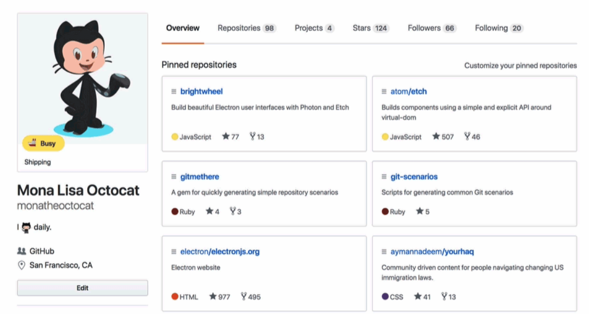

## Sobre los `README.md`

Los archivos README.md son documentos de texto con 
formato Markdown que se encuentran comúnmente en los 
repositorios de GitHub y en otros sistemas de control de versiones. 

El nombre "README" proviene de "Read Me", que indica su propósito principal:
proporcionar información relevante sobre el proyecto para que los usuarios 
puedan leerlo rápidamente.

Los README.md suelen contener información importante sobre el 
proyecto, como una descripción general del mismo, instrucciones de instalación, 
ejemplos de uso, requisitos del sistema, créditos y cualquier otra información
relevante que los usuarios o colaboradores puedan necesitar.

Dado que el README.md es el primer documento 
que muchos visitantes de un repositorio verán, 
es importante redactarlo de manera clara y concisa
para que puedan comprender rápidamente de qué se trata el proyecto y
cómo pueden interactuar con él. Un README.md bien elaborado puede ser **crucial**.

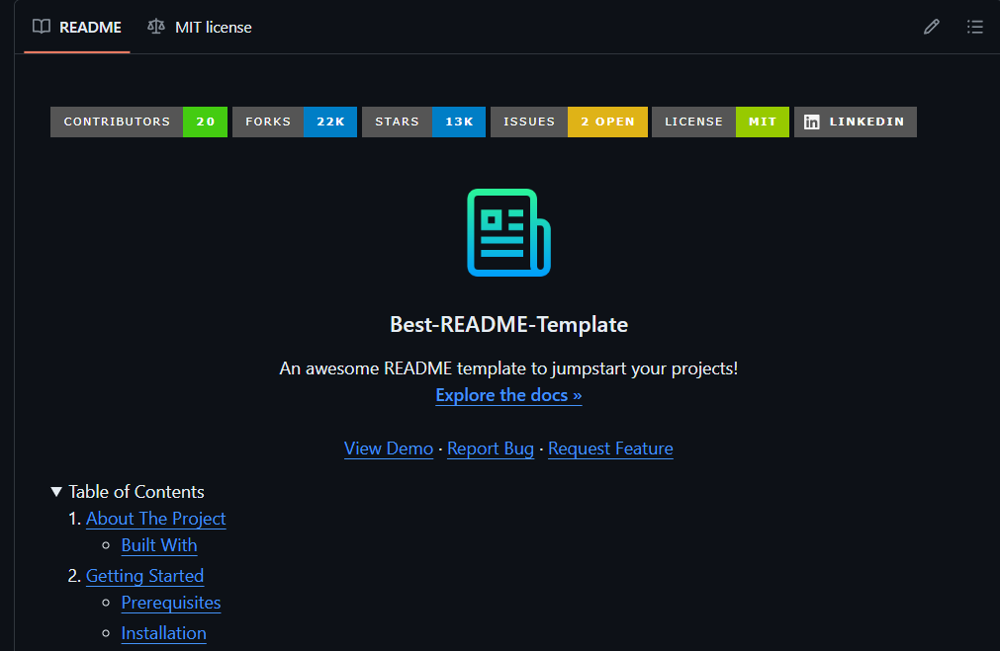

## Creando un `README.md` a la medida

Cuando se trata de crear un archivo `README.md`,
la estructura y el contenido dependen en gran medida 
del enfoque que deseamos darle. En términos generales, podemos 
dividir este proceso en dos partes distintas, adaptadas a diferentes propósitos:

**Para Proyectos**:

1. **Descripción Breve:** Título claro y breve descripción del proyecto.

2. **Instrucciones de Uso:** Pasos para instalar y utilizar el proyecto.

3. **Contribuciones:** Guía para contribuir al proyecto.

4. **Licencia:** Información sobre la licencia del proyecto.

**Para Portafolios**:

1. **Descripción Breve:** Título claro y breve descripción del portafolio.

2. **Lista de Proyectos:** Títulos y descripciones breves de proyectos anteriores.

3. **Tecnologías Utilizadas:** Destacar las tecnologías empleadas en cada proyecto.

### Para proyectos

> 🔑 **Nota:** Para una referencia sobre la estructura y contenido de un README de Proyectos,
>  utilizaremos el siguiente proyecto como ejemplo: [Proyecto Inventado](https://github.com/fralfaro/Github-Intro/blob/main/docs/github-readme/02-project.md). 

1. **Título y Logotipo:**
   - El título del proyecto, "Proyecto Inventado", es claro y conciso, proporcionando a los usuarios una identificación inmediata del proyecto.
   - El logotipo centrado agrega un toque visual al README, lo que puede hacer que el proyecto sea más memorable. Sin embargo, asegúrate de que el enlace a la imagen sea correcto y accesible.

2. **Tabla de Estado:**
   - Esta tabla muestra el estado del proyecto en términos de pruebas, paquete y metadatos.
   - Los badges proporcionan información instantánea sobre el estado del proyecto, como los resultados de las pruebas, la cobertura del código, la versión del paquete, etc. Esto ayuda a los usuarios a evaluar rápidamente la salud y la calidad del proyecto.

3. **Descripción del Proyecto:**
   - La descripción del proyecto proporciona una visión general del propósito, los objetivos y las características principales del proyecto.
   - Es importante que esta descripción sea clara y concisa, pero lo suficientemente detallada como para transmitir la utilidad y el valor del proyecto a los posibles usuarios.
    
     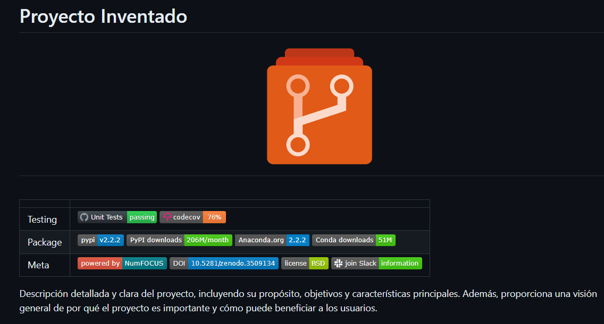

4. **Tabla de Contenidos:**
   - La tabla de contenidos enumera los diferentes apartados del README con enlaces directos a cada sección. Esto facilita la navegación y la búsqueda de información específica para los usuarios.
     
     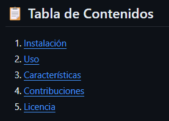
    
5. **Instalación:**
   - La sección de instalación proporciona instrucciones detalladas sobre cómo instalar el proyecto en diferentes entornos.
   - Los requisitos previos enumeran cualquier software adicional, configuraciones del sistema o permisos de usuario necesarios para la instalación.
   - Los pasos de instalación proporcionan comandos específicos que los usuarios pueden seguir para instalar el proyecto correctamente.
     
     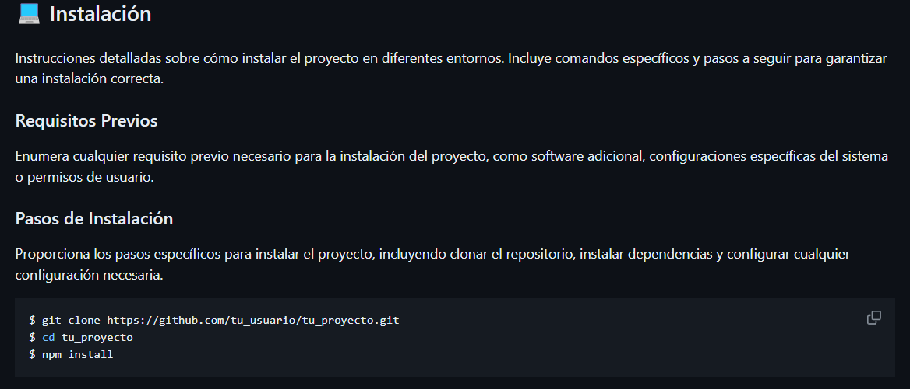
    
6. **Uso:**
   - La sección de uso ofrece instrucciones detalladas sobre cómo utilizar el proyecto una vez instalado.
   - La configuración informa a los usuarios sobre cualquier configuración adicional que necesiten realizar antes de utilizar el proyecto, como la configuración de variables de entorno o archivos de configuración.
   - Los ejemplos de uso proporcionan casos de uso comunes y comandos que los usuarios pueden ejecutar para interactuar con el software.
     
     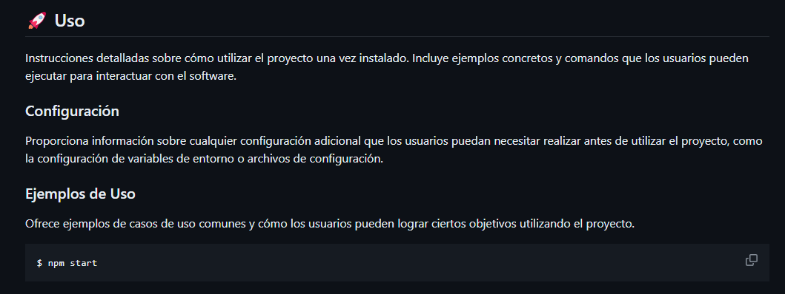
    
7. **Características:**
   - Esta sección enumera y describe las características principales del proyecto, resaltando las funcionalidades únicas o importantes que lo diferencian de otros proyectos similares.
   - Es importante destacar las características que hacen que el proyecto sea valioso para los usuarios y cómo estas características pueden beneficiarlos.

     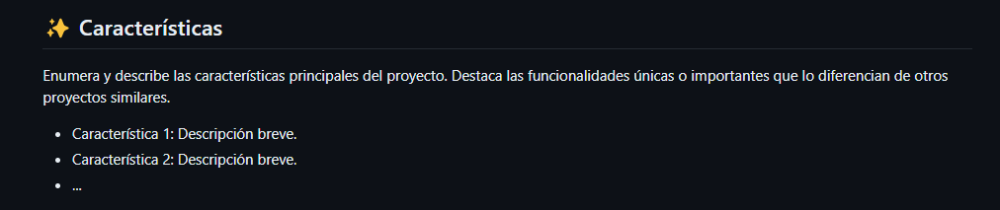

8. **Contribuciones:**
   - La sección de contribuciones proporciona instrucciones detalladas sobre cómo contribuir al proyecto.
   - La guía de contribución ofrece una guía paso a paso sobre cómo enviar solicitudes de extracción, informar problemas y cualquier otro proceso de contribución relevante.
   - Es importante facilitar a los posibles colaboradores el proceso de contribución al proyecto para fomentar la participación y el desarrollo continuo.
     
     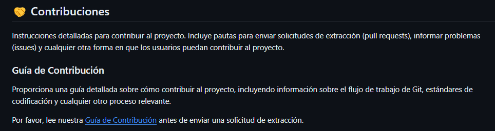
    
9. **Licencia:**
   - La sección de licencia informa a los usuarios sobre los términos de la licencia bajo la cual se distribuye el proyecto.
   - Proporciona un enlace a los términos de la licencia para que los usuarios puedan revisarlos y asegurarse de cumplir con ellos antes de utilizar, modificar o distribuir el software.
     
     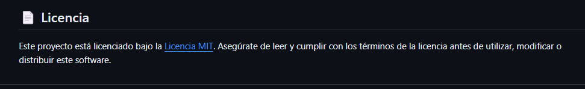

### Para portafolio

> 🔑 **Nota:** Para una referencia sobre la estructura y contenido de un README de Portafolio,
>  utilizaremos el siguiente proyecto como ejemplo: [Curso de Desarrollo Web](https://github.com/fralfaro/Github-Intro/blob/main/docs/github-readme/01a-web-development.md). 

1. **Título:**
   - El título "Curso de Desarrollo Web" es claro y describe el contenido principal del repositorio.

2. **Descripción:**
   - La descripción ofrece una visión general del curso, mencionando que abarca desde conceptos básicos hasta proyectos avanzados en el campo del desarrollo web.
   - Indica que los estudiantes aprenderán a crear aplicaciones web completas utilizando diferentes tecnologías y herramientas.

     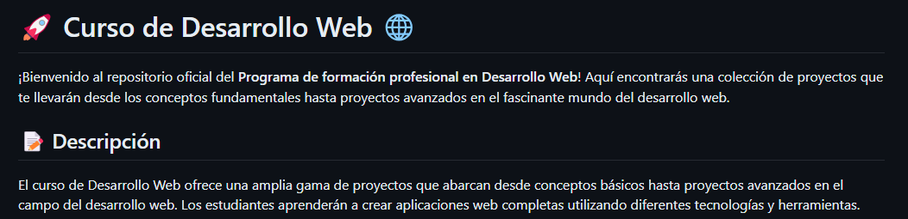

3. **Proyectos:**
   - Los proyectos están organizados en categorías según el nivel de habilidad y las tecnologías utilizadas.
   - Cada categoría de proyecto incluye una tabla que enumera los nombres y descripciones de los proyectos correspondientes.
   - Las descripciones proporcionan información sobre el propósito de cada proyecto y las tecnologías específicas utilizadas en su desarrollo.

     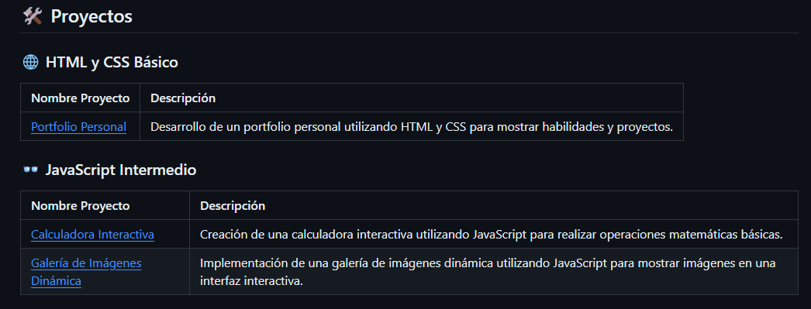

4. **Notas:**
   - Ofrece algunas notas adicionales para proporcionar contexto adicional sobre los proyectos.
   - Indica que los proyectos están listados en el orden en que se completaron, lo que puede ser útil para seguir una progresión lógica.
   - Destaca que cada proyecto incluye una descripción detallada y las tecnologías utilizadas, lo que brinda a los estudiantes información importante sobre lo que aprenderán en cada proyecto.
   - Sugiere que los usuarios pueden obtener más detalles sobre cada proyecto consultando los directorios correspondientes en el repositorio, lo que facilita la navegación y la búsqueda de información adicional.

     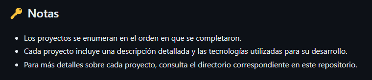
    
## Awesome README

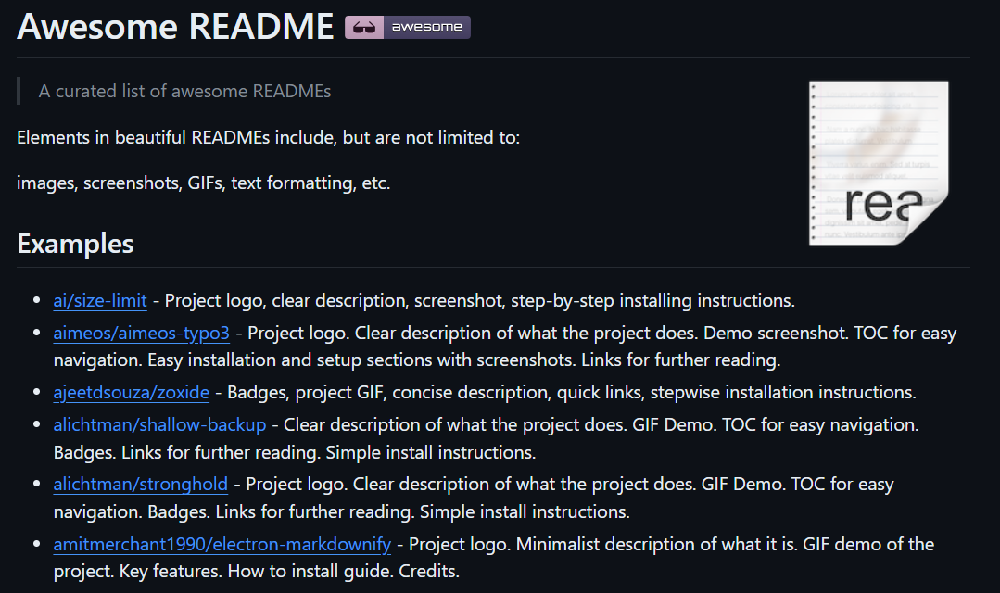

Una valiosa fuente de inspiración y orientación en este sentido 
es el repositorio [awesome-readme](https://github.com/matiassingers/awesome-readme) creado por **Matías Singers** en GitHub.
Este repositorio recopila una amplia variedad de ejemplos inspiradores y recursos útiles para la creación de READMEs impresionantes.

Desde estructuras organizadas hasta consejos prácticos y ejemplos de READMEs destacados, "awesome-readme" ofrece una amplia gama de recursos para ayudarte a mejorar la presentación y documentación de tus proyectos en GitHub.

Al explorar este repositorio, los desarrolladores pueden encontrar ideas innovadoras, plantillas útiles y ejemplos reales que les ayudarán a crear READMEs que destaquen entre la multitud y comuniquen eficazmente el valor de sus proyectos.

## Conclusión

La presentación de tus proyectos en GitHub es clave para avanzar en tu carrera profesional. 
Este tutorial te ha mostrado cómo personalizar tus repositorios de manera efectiva, 
ya sea para proyectos de software o portafolios profesionales. 

Al seguir estas prácticas recomendadas, puedes:

* Atraer la atención de potenciales colaboradores y usuarios.
* Comunicar claramente el valor de tus proyectos.
* Fomentar la colaboración y el crecimiento de la comunidad.
* Demostrar tus habilidades y experiencia de manera efectiva.
* Destacar entre otros repositorios y aumentar la visibilidad de tu trabajo.

Al dominar la presentación de tus proyectos en GitHub, puedes mejorar significativamente
tu presencia en línea, impulsar tu carrera profesional y abrir nuevas oportunidades de colaboración y 
crecimiento.